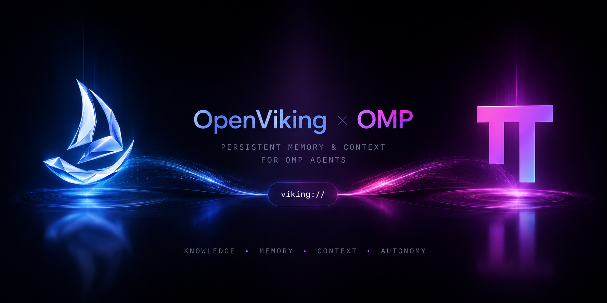

<p align="center">
  
</p>

<p align="center">
  <a href="https://github.com/cortexc0de/omp-openviking-memory"></a>
  <a href="https://github.com/volcengine/OpenViking"></a>
  <a href="https://omp.sh"></a>
  =18" />
  <a href="LICENSE"></a>
  
</p>

<p align="center">
  <strong>Top-tier memory plugin for <a href="https://omp.sh">Oh My Pi</a> via <a href="https://github.com/volcengine/OpenViking">OpenViking</a>.</strong><br/>
  Auto-recall before every prompt · capture after every turn · <code>viking://</code> filesystem · 11 tools · slash <code>/ov</code>
</p>

<p align="center">
  <code>omp plugin marketplace add github:cortexc0de/omp-openviking-memory && omp plugin install omp-openviking-memory</code>
</p>

---

## What it is

Native port of [`examples/pi-coding-agent-extension`](https://github.com/volcengine/OpenViking/tree/main/examples/pi-coding-agent-extension) for **OMP** (`can1357/oh-my-pi`, fork of `pi`). Runs as an **OMP Extension** for lifecycle hooks and ships an **Agent Plugins 1.0** `mcp.json` (`servers/mcp-proxy.mjs`, stdio → streamable HTTP) as fallback — without the Extension there is no auto-recall/capture.

> **Requires an OpenViking server** — local `http://127.0.0.1:1933` or remote. `curl http://127.0.0.1:1933/health` should return `ok`.

## Why this one

- **Current-prompt recall, not stale prefetch.** `before_agent_start` queues; `context` awaits `mode="context"` (`15 s` + `45 s` fused deadlines) for the prompt you just typed.
- **Prompt-cache stable.** `~/.openviking/omp-recall-ledger/` (0o700/0o600) reapplies the exact byte block to historical turns — keeps prefix caches hitting (#4137).
- **Full capture.** `syncBranch` after each turn → `pending-queue` replay on next boot (`0o700` dir / `0o600` files, atomic `rename`).
- **`viking://` guard.** `read`/`bash`/`glob`/`grep` on `viking://` is intercepted and rerouted to `viking_read`/`viking_search`.

## Install

### Marketplace (recommended)

```bash
# from a clone
omp plugin marketplace add ./ --scope project
omp plugin install omp-openviking-memory@omp-openviking-memory-marketplace --scope project
omp plugin list   # omp-openviking-memory@0.2.0
```

From GitHub:

```bash
omp plugin marketplace add github:cortexc0de/omp-openviking-memory --scope project
omp plugin install omp-openviking-memory --scope project
```

Dev link without publishing: `omp plugin install --force ./ --scope project` — Windows needs `mklink /J` (Developer Mode).

### Credentials (priority order)

1. `OPENVIKING_*` env — `OPENVIKING_URL`, `OPENVIKING_API_KEY` / `OPENVIKING_BEARER_TOKEN`, `OPENVIKING_ACCOUNT`, `OPENVIKING_USER`, `OPENVIKING_PEER_ID`
2. `~/.openviking/ovcli.conf` (`url`, `api_key`, `account`, `user`)
3. `~/.openviking/ov.conf` (`server.url` / `host`+`port`, `server.root_api_key`)
4. Fallback `http://127.0.0.1:1933` (loopback `http`, remote requires `https` when a token is set)

Peer isolation: `OPENVIKING_PEER_ID` or `cwd → workspace-peer`. Disable: `OPENVIKING_WORKSPACE_PEER=0`. Scope: `OPENVIKING_RECALL_PEER_SCOPE=actor|all`.

```bash
curl http://127.0.0.1:1933/health
node scripts/setup.mjs   # wizard for ovcli.conf
```

### Behavior config — `config.json` / `extensions/config.json`

```json
{
  "enabled": true,
  "syncTurns": true,
  "recallTokenBudget": 2000,
  "scoreThreshold": 0.35,
  "minQueryLength": 3,
  "profileTokenBudget": 10000,
  "resumeContextBudget": 32000,
  "commitTokenThreshold": 20000,
  "takeover": { "enabled": false, "tokenThreshold": 30000, "keepRecentTurns": 3, "overviewBudget": 3000, "overviewPollMs": 2000, "overviewPollMax": 15 }
}
```

`takeover.enabled:false` by default — `pi` defaults to `true`. Keeps `memory.backend` intact.

## Lifecycle

| Event | What happens |
|---|---|
| `session_start` | `health()` → `ensureSession(ov-…)` → `replayPending()` → profile (`10 k`) + archive overview (`32 k`) |
| `before_agent_start` | `queueSearch(prompt)` — no I/O, zero UI latency |
| `context` | `fetchAssembledContext` + ledger injection |
| `turn_end` | `syncBranch` → OV, `takeover.onTurnSynced`, footer `OV ✓/✗ · ↩ · ctx` |
| `session_before_compact` | takeover **or** `commit()` + rehydration |
| `session_shutdown` | `shutdown()` (bounded `1.8 s` replay) → `commit()` |
| `tool_call` | `viking://` uri-guard intercept |

## Tools (11) · Commands · Skill

**Tools** — `viking_search`, `viking_read`, `viking_browse`, `viking_remember`, `viking_forget`, `viking_add_resource` (SSRF-guarded), `viking_archive_expand`, `viking_tree` (≥0.4.14), `viking_write`, `viking_edit`, `viking_health`. Optional `tree`/`write`/`edit` degrade gracefully on old servers.

**Guard** — `viking://` on `read`/`bash`/`glob`/`grep` → `viking_read`/`viking_search`.

**Commands** — `/viking` and `/ov`: `status`/`health` (default, shows `systemStatus` `user`/`account`), `commit`/`flush` (forced sync + commit).

**Skill** — `skill://openviking-memory` (`skills/openviking-memory/SKILL.md` + `references/optional-tools.md`) and `commands/ov.md` (slash `/ov`).

## Coexistence with `memory.backend`

| `memory.backend` | OMP behavior | OV recommendation |
|---|---|---|
| `off` (default) | no built-in memory | `takeover.enabled:true` is fine if you want OV to own compaction |
| `local` | `MEMORY.md` guidance (~5 k) | `false` (default) — both layers inject, no fight |
| `hindsight` / `mnemopi` | remote backend owns `session_before_compact` | `false` — Extension does only `commit()`, no `{compaction}` |

## Security notes

- `add_resource` allows only `http/https`, blocks `localhost/private/169.254/*.local` hostnames defense-in-depth.
- Bearer token over `http` is refused for non-loopback hosts (use `https` externally).
- Debug logs (`OV_DEBUG_LOG`) are `0o700`/`0o600` and redact full `payload` → `payloadBytes`; never enable on shared machines.
- `category` for `viking_remember` is allowlisted to `^[a-z][a-z_-]{0,31}$`.

## Fallback — MCP

`mcp.json` exposes `servers/mcp-proxy.mjs` (`MAX_CONCURRENT=16`, `Mcp-Session-Id`, hot-reload of `~/.openviking/ovcli.conf` without restart). Auto-memory is off in pure MCP mode — only manual tool calls.

## Development

```bash
npm test                          # node --test — 23 cases (185 ms)
npm run typecheck                 # tsc --noEmit
node --check extensions/openviking.ts
node scripts/sync.mjs             # refresh shared/ + servers/shared from upstream lib
node scripts/e2e-live.mjs         # live: OPENVIKING_URL + E2E_LLM_API_KEY + omp
omp plugin doctor                 # 6 ok
```

Vendored `shared/` + `lib/` mirror `examples/memory-plugin-shared/lib` with `// GENERATED FROM` headers (27 files). `assets/social-preview.png` is `1280×640` (GitHub `og:image`).

## License

`AGPL-3.0` — same as OpenViking.

---

<p align="center">
  <sub>Built on <a href="https://github.com/volcengine/OpenViking">OpenViking</a> · for <a href="https://omp.sh">Oh My Pi</a> — banner: OpenViking × OMP warp (<code>viking://</code>)</sub>
</p>
